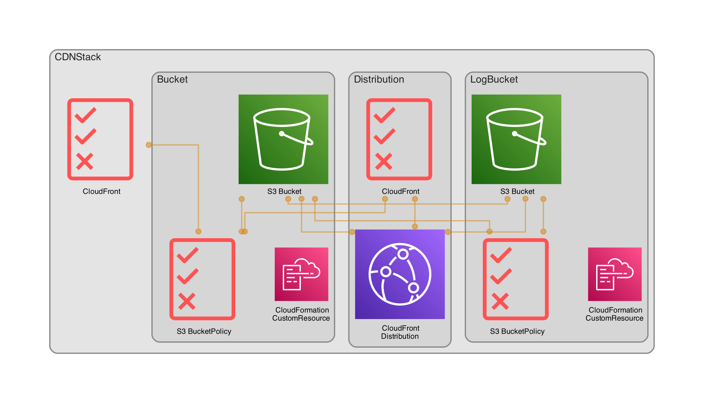

# Personal AWS CDK Infrastructure

## Useful commands

 * `cdk deploy`      deploy this stack to your default AWS account/region
 * `cdk diff`        compare deployed stack with current state
 * `cdk synth`       emits the synthesized CloudFormation template
 * `go test`         run unit tests
 * `make diagrams`   generate diagrams of the stacks

## Stack Diagrams

### CDN Stack
Simple CDN Stack with S3 and CloudFront distribution

